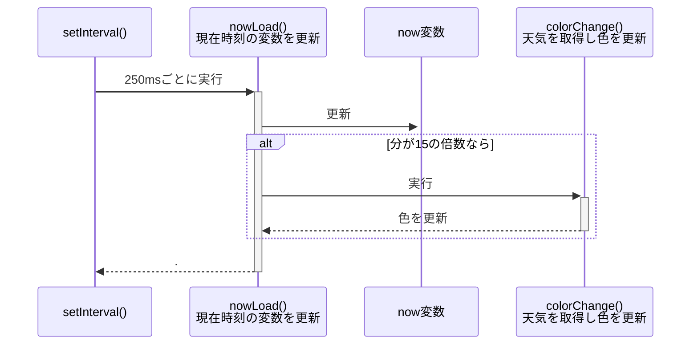
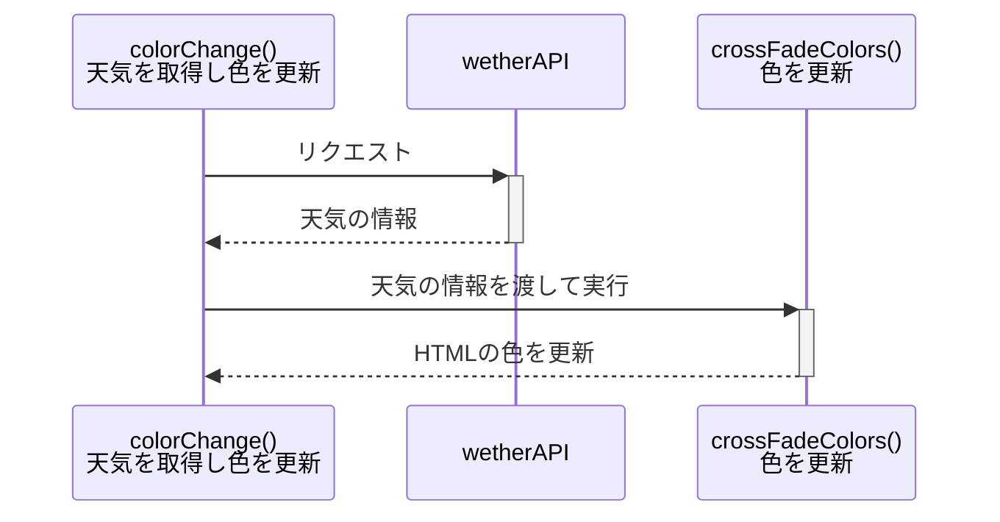
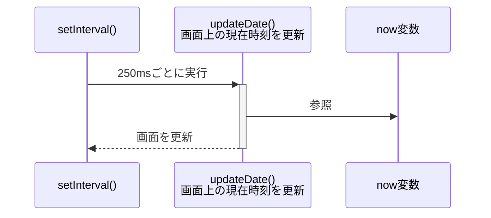
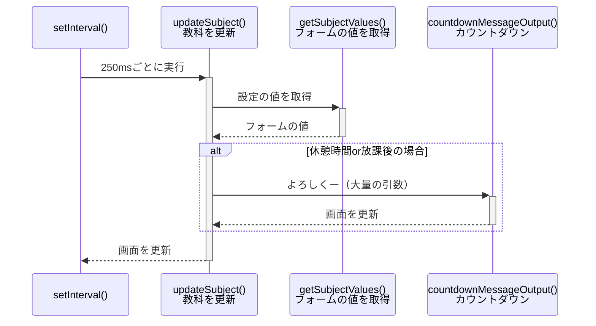

# 時計

## 概要

時間割機能がついている時計。
カウントダウン等の機能がついている。

別名は`digital-clock`。

* [フォーク元のGitHubリポジトリ](https://github.com/Ta-SasakiKaito/digital-clock)
* [公開されているページ](https://ta-sasakikaito.github.io/digital-clock/timeDisplay.html)

## 機能

この時計は結構多機能。

### 基本的な機能

※Slackからのコピペ

* 現在時刻を表示
* 現在行われている科目名を表示
  * 休憩時間の場合は次の科目名とカウントダウンを表示
  * デフォルトは分単位、1分切ったら秒単位に
* 時間と天候によって背景色と文字色を変更
  * 時間は「朝」「昼」「夕方」「夜」
  * 天候は「晴れ」「曇り」「雨」
  * 合計12通りを15分ごとに適切なパターンに反映するように
* 画面下に進捗バーを表示
  * 各状況の開始時間と終了時間を反映
* 左上のNマークから設定画面に
  * マークを押すと簡単なアニメーション
  * 科目名を変更できるように
  * 1コマ毎に最大2科目入力可能

### それ以外

上に書いてある機能以外の機能やメモなど。

* [Wake Look API](https://developer.mozilla.org/ja/docs/Web/API/Screen_Wake_Lock_API)を使用して画面が暗くならないようにする
  * 全画面の時のみ有効
  * 下の方にWake Lookをタイムアウトで中止するっぽいコードがあるが、現時点では無効になっている模様
* 全画面機能
  * 全画面にする/全画面を解除するボタンがある
  * escキーを押しても戻らない仕様
* 設定の保存にはローカルストレージを使っている
  * これによりリロードしても設定がリセットされなくなる
  * リンクから辿った場合ローカルストレージはクリアされる
* 一部ではjQueryを使っている
* デバッグするときは`isDebug`変数を`true`に設定する
  * 現在時刻の書き換えは`now`変数でできる
* タイムテーブルやデフォルトの科目設定はコード内に書かれている
* 天気の取得は[API](https://api.openweathermap.org/)から行なっている
  * APIキーはコード内に直書き
  * 悪用厳禁
* 背景色はゆっくり変えるようになっている
* 時計の更新は250msごと、背景色や文字色変更の判定は15分ごと
* もちろんテストなんてない

## 全体図

シーケンス図は一つにすると長すぎるため分割している。

### 現在時刻の更新箇所

* 現在時刻を管理している変数`now`を更新  
（※画面上の現在時刻はここでは更新していない）
* 天気や時刻に応じて色を変更
  * APIから天気を取得

* * *

画面上の現在時刻の更新箇所はこちら。
画面上の現在時刻は、グローバル変数`now`を元に`updateDate`で更新している。

...`nowLoad`から`updateDate`呼んでもよかったのでは？？

### 教科の更新箇所

* デフォルトの教科を定義
* 設定の`placeholder`を更新
* 今何コマ目か、今の教科、休憩時間かどうかなどを判定
* プログレスバーを更新
* 画面を更新

ちなみに`updateSubject`は250行ほどある。
図には書いてないけど`progressBarSet`の呼び出しもここ。

また、* `getSubjectValues`は上書きして実行するため、引数にデフォルトの教科が必要。

### 設定等

ここの内容は関数で定義するのではなく、ページの読み込み時に実行されている。

* 設定ボタンとフルスクリーンボタンの見た目をjQueryで切り替える
* 全画面ボタンを押したら全画面を切り替える
  * ボタンが押されたら`toggleFullScreen`を実行
* `esc`キーをロックする

ローカルストレージに関する処理：

* `loadInput`で入力欄をローカルストレージの内容にする
* `saveInput`で入力欄の内容をローカルストレージに保存する
* 設定ボタンを押した時に上二つのどちらかが実行される
  * 設定画面をボタンで開く場合：`loadInput`
  * 設定画面をボタンで閉じる場合：`saveInput`
* リンクから辿った場合はローカルストレージの内容を削除
  * `localStorageClear`関数内で判定している
  * ページの読み込み時に実行

Wake Look APIに関する処理：
* `enableWakeLock`でWakeLookをONにする
* `disableWakeLock`でWakeLookをOFFにする
* `toggleFullScreen`内部で上の二つを呼び出している
